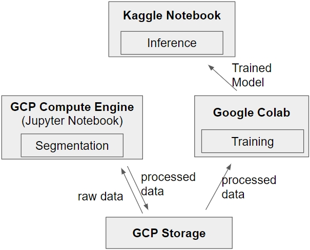

<h1>Human Protein Atlas Solution</h1>

Kaggle - Human Protein Atlas - Single Cell Classification    
https://www.kaggle.com/c/hpa-single-cell-image-classification   
본 repository는 data가 포함되어 있지 않으며, 일부 코드는 Kaggle Notebook에서의 구동을 전제로 합니다.   
자세한 내용은 아래 'About Codes' 항목에 설명되어 있습니다.

<h2>Project details</h2>

|||
|---|---|
|Period|2021.03 ~ 2020.05|
|Team|Juyoung Ha, Kyungtae Im|
|Rank|Top 33%|

|Tech|Detail|
|---|---|
||Main algorithm|
||Prediction model|
||Preprocessing|
||Store & handle 2TB images|

<h2>Model Explanation</h2>

본 프로젝트는 단백질 세포 이미지에서 18개의 특징을 multi-label classification 통해 구별해야 합니다.
하지만 training data가 세포 단위로 labeling 되어 있지 않고 이미지 단위로 labeling 되어 있어 weakly-labeled 환경이라 볼 수 있습니다.

본 repository의 모델은 다음과 같습니다. 한계점은 아래 limitation 항목을 참조하세요.

1. 세포별 segmentation 및 preprocessing, re-labeling
2. Resnet Backbone(224 x 224) + FC layers
3. Focal loss 활용

<h2>About Codes</h2>

각 코드의 구동 환경이 달라 아래의 설명을 참조하세요.

* inference
    - kaggle submission code (Kaggle notebook에서 구동)
* segmentation
    - rgby 채널 이미지를 하나로 합치고, 세포별로 segmentation 하여 개별 이미지로 저장합니다.
    - raw data는 매우 큰 2~3TB의 용량으로, Google Cloud Storage에 저장하였습니다.
    - 많은 CPU 연산이 필요하여 GCP Compute Engine instance를 생성하여 jupyter notbook에서 구동하였습니다.
* train
    - 학습 모델을 포함하고 있습니다. (Google Colab에서 구동)

<h2>Limitation</h2>

사실상 본 모델은 Baseline에 지나지 않습니다.
전형적인 image classification 모델이며, HPA 과제의 가장 큰 특징인 Weakly-labeled를 효과적으로 해결할 수 없습니다.
시간 관계상 구현하지는 못하였으나, 효과적인 개선방안은 다음과 같습니다.

1. 본 모델에서는 처음에 별도로 segmentaion을 진행하였으나, weakly-labeled segmentation 관련 논문을 참고하여 segmentation을 진행하면 더 효과적인 결과를 얻을 수 있을 것 입니다.
2. label smoothing 기법을 활용해 잘못된 label의 영향을 줄일 수 있습니다.
3. 이미지 전체로 1차적인 classification을 진행하고, 각 세포들에 대한 별도의 classification을 진행, 위 정보들과 한 이미지 내의 다른 세포간의 위치정보를 포함하여 최종 prediction 모델을 구성하면 정확도를 개선할 수 있을 것입니다.
